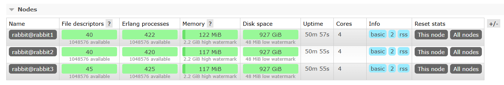

## Local random exchange
Local random exchange sends messages to the local queue bound to the exchange. This approach is important when we have 
a number of different nodes, and we want the exchange to publish the messages to the queue that has online consumers on specific
node. In this way, we guarantee that the messages are always published to the current node's queue.

## Launch RabbitMQ
I provide compose file, that could be used to launch a cluster of nodes.
```bash
cd "Local random exchange"
docker compose up -d
```
This will launch the container that has 3 rabbitmq nodes(rabbit@rabbit1, rabbit@rabbit2, rabbit@rabbit3) using the latest
`RabbitMQ` image. Then, we have to connect nodes with each other to form a cluster. To achieve that, navigate to the 
`Exec` tab in Docker Desktop and enter the following commands:
```
# on rabbit2
rabbitmqctl stop_app
# => Stopping node rabbit@rabbit2 ...done.

rabbitmqctl reset
# => Resetting node rabbit@rabbit2 ...

rabbitmqctl join_cluster rabbit@rabbit1
# => Clustering node rabbit@rabbit2 with [rabbit@rabbit1] ...done.

rabbitmqctl start_app
# => Starting node rabbit@rabbit2 ...done.
```

and the same on the third node:
```
# on rabbit3
rabbitmqctl stop_app
# => Stopping node rabbit@rabbit3 ...done.

# on rabbit3
rabbitmqctl reset
# => Resetting node rabbit@rabbit3 ...

rabbitmqctl join_cluster rabbit@rabbit2
# => Clustering node rabbit@rabbit3 with rabbit@rabbit2 ...done.

rabbitmqctl start_app
# => Starting node rabbit@rabbit3 ...done.
```
As the result, in `Management` we should see something like:


You can read more about clustering [here](https://www.rabbitmq.com/docs/clustering#clustering-and-clients)

## The concept demonstration
I use 2 clients and servers(for node 5672, and 5673) to show how does the concept look like. The first client opens a channel
in node `5672` and declares `local-random-exchange` of type `x-local-random`. This is needed to declare the exchange
as a local random. Then, 2 queues are bound to this exchange with routing key being empty. This configuration is essential
as the Local random exchange doesn't allow a routing key to be used when binding queues to the exchange. 
```csharp
var firstQueue = await channel.QueueDeclareAsync(queue: "first_client_queue", exclusive: false);
var secondQueue = await channel.QueueDeclareAsync(queue: "second-client-queue", exclusive: false);
await channel.ExchangeDeclareAsync("local_random_exchange", "x-local-random");
await channel.QueueBindAsync(firstQueue.QueueName, exchange: "local_random_exchange", routingKey: string.Empty);
await channel.QueueBindAsync(secondQueue.QueueName, exchange: "local_random_exchange", routingKey: string.Empty);
```
The second client does the same operations, but on the `5673` node. The difference between two clients is that the first client
publishes the message tagged from 0 to 99, whereas the second client publishes the messages tagged from 100 to 150.

Now, let's look up to servers' code. The first server consumes the messages from the `first_client_queue` and the second
one consumes from the `second_client_queue` and reply to the client using the [Direct reply-to](https://github.com/blendereru/rabbitmq-dotnet-samples/tree/main/Direct%20reply-to)
pattern. And that's pretty much all they do. 

So if we now launch both servers and either of the clients, we would see that only one server consumes messages. And that is 
the one that is on the same node as the client.

At the end, you would ask why do we even need this ? Local random exchange solves 2 [problems](https://www.rabbitmq.com/docs/local-random-exchange#motivation):
* Low latency: the publisher may or may not be able to proceed until it gets a response; therefore the message should be delivered to the consumer as quickly as possible. With other exchange types, the queue could reside on a different node, which means an additional network hop to deliver the message. Local random exchange solves this problem by always delivering messages to a local queue. If there are no local queues bound to this exchange, the message won't be delivered.
* Scalability: the ability to add additional application instances to handle more requests. Binding more queues to a local random exchange automatically spreads the requests across more queues. Exclusive queues can be used by the consumers to ensure they are node-local.


