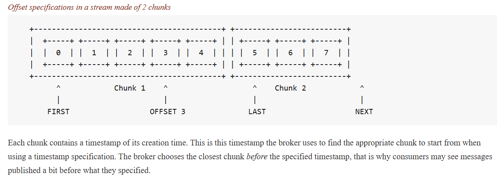

## Streams
Streams are append-only logs, which means the messages aren't deleted after being consumed. A single 
message can be consumed multiple times.

## Configuration
Using dedicated stream [binary protocol plugin](https://www.rabbitmq.com/docs/stream#overview) makes it easier 
to work with streams and uses stream's full capabilities. In RabbitMQ, port 5552 serves as the default
communication channel for the Stream Plugin, which facilitates high-throughput messaging by enabling
clients to interact with streams using the RabbitMQ Stream protocol. To expose the port and run the server
instance:
```bash
docker run -it --rm --name rabbitmq -p 5552:5552 -p 5672:5672 -p 15672:15672 -e RABBITMQ_SERVER_ADDITIONAL_ERL_ARGS='-rabbitmq_stream advertised_host localhost' rabbitmq:4.0-management
```
The configuration above exposes other ports as well(e.g. 15672 to enable management). In order to enable 
stream plugins, the following commands are required:
```bash
rabbitmq-plugins enable rabbitmq_stream rabbitmq_stream_management
```
This configuration activates:
1) `rabbitmq_stream` plugin - introduces the stream functionality to RabbitMQ
2) `rabbitmq_stream_management` plugin - extends the standard RabbitMQ
Management UI to include features specific to stream management.

Both producer and consumer's configuration
depends on `StreamSystem` class, which is essential to opening the connection:
```csharp
var streamSystem = await StreamSystem.Create(new StreamSystemConfig()
{
    UserName = "guest",
    Password = "guest",
    Endpoints = new List<EndPoint>() {new IPEndPoint(IPAddress.Loopback, 5552)}
}).ConfigureAwait(false);
```
### Producer
Producer creation:
```javascript
var producer = await Producer.Create(new ProducerConfig(streamSystem, streamName)).ConfigureAwait(false);
```
Message publication:
```javascript
var message = new Message(Encoding.UTF8.GetBytes("Hello, this is my message"));
await producer.Send(message).ConfigureAwait(false);
```
The Send method can take either `Message` or `List<Message>` objects to send a batch of messages. When
sending messages in a batch it is possible to specify the compression algorithm:
```javascript
await producer.Send(messages, CompressionType.Gzip).ConfigureAwait(false);
```
By default, `.NET Stream Client` implements `Gzip` algorithm, but it is possible to specify the [other ones](https://rabbitmq.github.io/rabbitmq-stream-dotnet-client/stable/htmlsingle/index.html#sub-entry-batching-and-compression)
implementing `ICompressionCodec` interface and registering it with the `StreamCompressionCodecs` class.
### Consumer
In order to understand the consumption process we, firstly have to understand the [Offset tracking](https://rabbitmq.github.io/rabbitmq-stream-dotnet-client/stable/htmlsingle/index.html#specifying-an-offset) mechanism
RabbitMQ Streams. When consuming the message, the consumer always specifies the offset to start consuming
from. So, when we specify `OffsetTypeFirst()` we start consuming from the beginning of the stream.

It is also important to mention how messages are stored in streams. They are stored in batches(or chunks)
as Transmitting messages in chunks minimizes network overhead by reducing the number of individual message
transmissions. The following [picture](https://rabbitmq.github.io/rabbitmq-stream-dotnet-client/stable/htmlsingle/index.html#specifying-an-offset) best describes chunks:


Consumer configuration:
```javascript
var consumer = await Consumer.Create(new ConsumerConfig(streamSystem, streamName)
{
    // set other properites
});
```
`ConsumerConfig` provides different properties:
* `OffsetSpec` - The offset to start consuming from.
* `MessageHandler` - event, The callback for inbound messages.
* `Reference` - a string specifying the consumer name. Is needed when tracking the offset of specific consumer(uses this parameter for this purpose). This allows the same
consumer to keep consuming where it left off.

Also, it is possible to specify the `Crc(Cyclic Redundancy Check)`, which is needed to ensure the 
integrity of messages during transmission and storage. From the [documentation](https://rabbitmq.github.io/rabbitmq-stream-dotnet-client/stable/htmlsingle/index.html#crc-on-delivery):
> RabbitMQ Stream provides a CRC32 checksum on each chunk. The client library can check the checksum before parse the chunk and throw an CrcException exception if the validation fails. By default the CRC32 checksum is not enabled, to enable it you need to set the ICrc32 interface in the ConsumerConfig

Example configuration:
```csharp
var consumer = await Consumer.Create(new ConsumerConfig(streamSystem, streamName)
{
    Crc32 = new UserCrc32(),
    Reference = "first_consumer",
    OffsetSpec = new OffsetTypeFirst(),
    MessageHandler = async (_, consumer, context, message) =>
    {
        var body = Encoding.UTF8.GetString(message.Data.Contents.ToArray());
        var userName = message.ApplicationProperties["userName"];
        var email = message.ApplicationProperties["email"];
        if (userName == null || email == null)
        {
            Console.WriteLine("The message doesn't contain the user's metadata");
            await Task.CompletedTask.ConfigureAwait(false);
        }
        else
        {
            await consumer.StoreOffset(context.Offset).ConfigureAwait(false);
            Console.WriteLine($"The message {body} was received from {userName} with email: {email}");
        }
    }
}).ConfigureAwait(false);
```