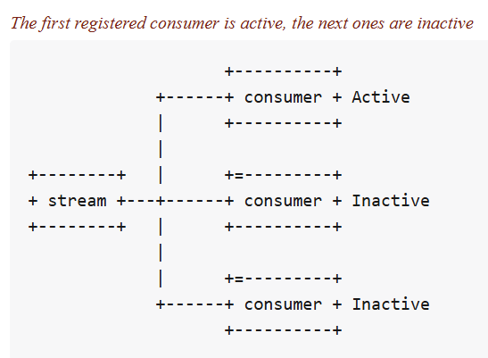
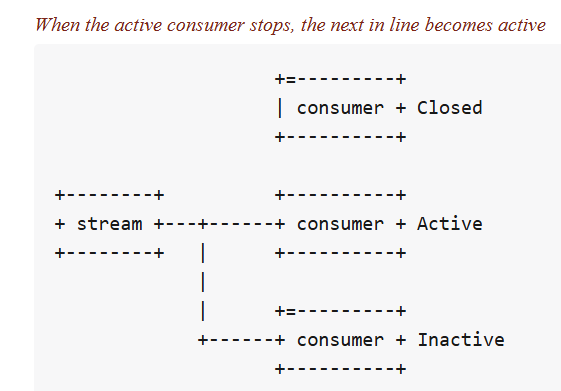
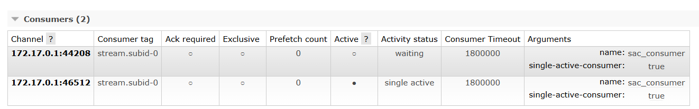

## Single Active Consumer on RabbitMQ Streams
When the single active consumer feature is enabled for several consumer instances sharing the same stream
and name, only one of these instances will be active at a time and so will receive messages.



In the configuration above, we have 3 consumers but only the first registered one becomes active and the
others remain idle. When this consumer becomes down, one of the other consumers left start to consume 
from the stream. 



## Understand example
In order to enable the single active consumer feature in consumers, we, firstly, have to set
`IsSingleActiveConsumer` boolean property to `true`.Then, setting the `Reference` is mandatory.
In this case, the consumers that share the same `Reference` name will be able to keep consuming from
where the previous consumer left. In order to accomplish this, a consumer must implement `ConsumerUpdateListener`
event, otherwise, the idle consumers will always start consuming from the value of the property set in
`OffsetSpec`

```csharp
var consumer = await Consumer.Create(new ConsumerConfig(streamSystem, "my-sac-stream")
{
    Reference = "sac_consumer",
    OffsetSpec = new OffsetTypeFirst(),
    IsSingleActiveConsumer = true,
    MessageHandler = async (_, consumer, context, message) =>
    {
        var text = Encoding.UTF8.GetString(message.Data.Contents.ToArray());
        Console.WriteLine($"The message {text} was received");
        if (message.ApplicationProperties.ContainsKey("Id") && message.ApplicationProperties["Id"] is int id)
        {
            if (id % 25 == 0)
            {
                await consumer.StoreOffset((ulong)id);
            }
        }
        await Task.CompletedTask.ConfigureAwait(false);
    },
    ConsumerUpdateListener = async (consumerRef, stream, isActive) =>
    {
        Console.WriteLine($"ConsumerUpdateListener triggered for stream '{stream}' with consumer reference '{consumerRef}'. IsActive: {isActive}");
        try
        {
            var offset = await streamSystem.QueryOffset(consumerRef, stream).ConfigureAwait(false);
            return new OffsetTypeOffset(offset);
        }
        catch (OffsetNotFoundException)
        {
            Console.WriteLine(
                $"Offset not found for stream {stream} and consumer {consumerRef}. Will use the first offset");
            return new OffsetTypeFirst();
        }
    }
}).ConfigureAwait(false);
```
In our example, we have 2 consumers with the same code. I use manual offset tracking mechanism, and 
store the offset of every 25 messages. `ConsumerUpdateListener` is triggered when the consumer becomes
the active one and I start querying the offset of consumer through `QueryOffset`:
```csharp
var offset = await streamSystem.QueryOffset(consumerRef, stream).ConfigureAwait(false);
return new OffsetTypeOffset(offset);
```
If the consumer is the first one in the group, `QueryOffset` throws `OffsetException` as it doesn't find
the offset of consumer with specific `reference`. Group here means consumers that share the same `reference`,
if consumers' reference differ, they are located in different groups, in this way single active consumer
works as `1 active consumer per group`. So in the `catch` block we return the `first` offset
indicating the consumer should start consuming from the first message. 

If we start both consumers we will see that the 2nd one stays idle, while first one is doing consumption:
